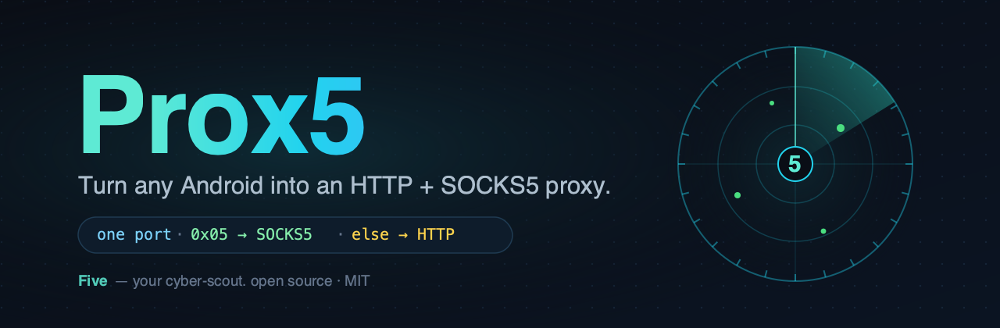
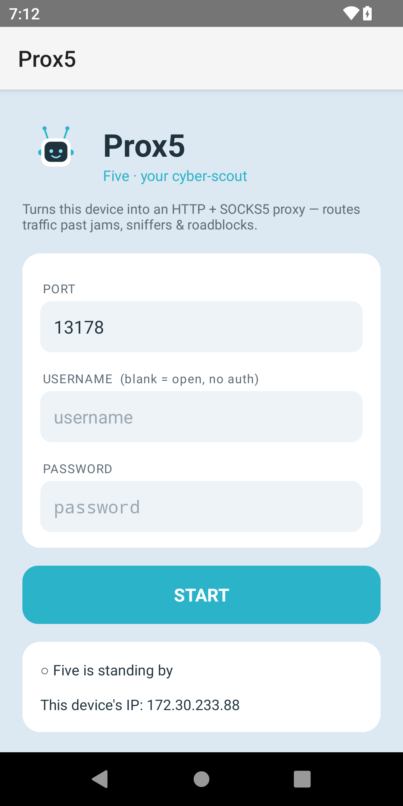

<div align="center">



# Prox5

**Turn any Android device into an HTTP + SOCKS5 proxy.**
Meet **Five** — a tiny cyber-scout that routes your traffic past jams, sniffers & roadblocks.

</div>

---

## What it does

Prox5 runs a foreground service that serves **both an HTTP proxy and a SOCKS5 proxy on a single port**. It peeks the first byte of each connection (`0x05` → SOCKS5, otherwise → HTTP), so you point any client at `<device-ip>:<port>` as *either* protocol and it just works. Traffic egresses through the device's network connection.

- 🔀 **HTTP + SOCKS5 on one port** — absolute-URI requests, `CONNECT` tunneling for HTTPS, and SOCKS5 `CONNECT` (IPv4 / IPv6 / domain).
- 🔒 **Optional auth** — SOCKS5 username/password (RFC 1929) and HTTP Basic (`Proxy-Authorization`). Leave it blank to run open.
- 📡 **Foreground service** — keeps running when the app is backgrounded.
- 📱 **`minSdk 21`** (Android 5.0+) — runs on phones, tablets, and old terminals alike.
- 🪶 **Tiny & dependency-free** — pure framework + Kotlin stdlib. No third-party libs.

<div align="center">

</div>

## Build

Requires the Android SDK, JDK 17+, and Gradle.

```bash
./gradlew :app:assembleDebug      # app/build/outputs/apk/debug/app-debug.apk
./gradlew :app:assembleRelease    # app/build/outputs/apk/release/app-release.apk  (signed)
```

Release signing reads from `keystore.properties` + a keystore (both git-ignored). See
[`docs/RELEASING.md`](docs/RELEASING.md) for generating a keystore and configuring CI signing.

## Install

**Just want the app?** Grab the latest APK from the
**[Releases page](https://github.com/nathanabrewer/Prox5/releases/latest)** — no cloning, no Gradle.
Download `Prox5-<version>.apk` onto your Android device (5.0+), tap it, and allow installing from
**unknown sources** if prompted. Then open Prox5 → (optionally set a username/password) → tap **Start**.

> Releases are cut by CI ([`.github/workflows/release.yml`](.github/workflows/release.yml)). If the
> repo has signing secrets configured the APK is release-signed; otherwise it's debug-signed (still
> installable, but to update in place you must uninstall the old build first). See
> [`docs/RELEASING.md`](docs/RELEASING.md).

Prefer `adb`?

```bash
adb install -r app/build/outputs/apk/release/app-release.apk
# open Prox5 → (optionally set a username/password) → tap Start
```

Point a client at `<device-ip>:<port>` (default **13178**):

```bash
curl -x http://user:pass@<device-ip>:13178   https://example.com   # HTTP proxy
curl -x socks5h://user:pass@<device-ip>:13178 https://example.com   # SOCKS5
```

Browsers: configure the IP:port as an **HTTP** *or* **SOCKS5** proxy. In Chrome:
`--proxy-server="socks5://<device-ip>:13178"`.

## ⚠️ Security

If you set **no** username/password, the proxy is **open** — anyone who can reach the port can relay through your device's network. On shared or sensitive networks, **set a username/password** (and ideally only expose it over a private network/VPN like Tailscale).

## License

MIT — see [LICENSE](LICENSE).

<div align="center"><sub>Built with help from Claude Code.</sub></div>
